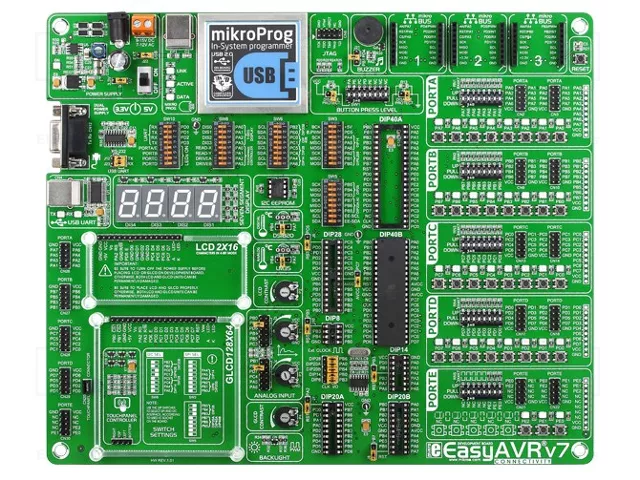

# Controller RGB pe ATmega32

Firmware embedded scris la nivel de registri pentru microcontrollerul ATmega32.
Controleaza un sistem de LED-uri RGB printr-un meniu afisat pe display 7 segmente
cu 4 cifre, cu iesire PWM, reglaj analogic prin ADC, efect strobe si navigare
cu trei butoane cu debouncing software si auto-repeat — totul condus dintr-un
singur ISR de Timer2.

---


## Project Overview

This project was developed and deployed on the EASYAVR V7 development board by MikroElektronika.

## Hardware Platform

- Board: EASYAVR V7 (MikroElektronika)
- MCU: Microchip AVR

## Demo




## Descrierea hardware

| Componenta | Conexiune |
|---|---|
| LED RGB (Rosu) | PB3 — Timer0 PWM (OC0) |
| LED RGB (Verde) | PD5 — Timer1 PWM (OC1A) |
| LED RGB (Albastru) | PD4 — Timer1 PWM (OC1B) |
| Display 7 seg (selectie cifra) | PORTA bitii 0-3 |
| Display 7 seg (segmente) | PORTC bitii 0-6 |
| Buton OK | PD2 (activ LOW) |
| Buton NEXT | PD3 (activ LOW) |
| Buton BACK | PB2 (activ LOW) |
| Potentiometru dimmer analogic | Canalul ADC 6 (PC6) |

---

## Functionalitati

**Iesire PWM**
Trei canale PWM independente controleaza LED-ul RGB. Timer0 ruleaza in mod
Fast PWM pentru Rosu; Timer1 (16-bit, ICR1 = 255) ofera doua canale pentru
Verde si Albastru. Toate raporturile de umplere sunt calculate din valori
procentuale (0-100) folosind aritmetica intreaga pentru a evita virgula
mobila pe AVR.

**Meniu ierarhic pe display 7 segmente**
Display-ul este multiplexat manual in ISR-ul Timer2 — o cifra este
reimprospatata per tick. Meniul are trei niveluri de adancime:

```
Nivel 0 (meniu)   — top-level: RGB | DIM | dAmC | STRB
Nivel 1 (meniu2)  — selectie sub-element
Nivel 2 (meniu3)  — mod editare valoare
```

**Debouncing software si auto-repeat pentru butoane**
Butoanele sunt sondate la fiecare 1 ms in ISR. Nu se folosesc intreruperi
externe. Fiecare buton urmareste:
- detectia frontului de apasare/eliberare
- durata apasarii (contor in ms)
- auto-repeat dupa 1 s de tinere, declansand la fiecare 250 ms (4 evenimente/secunda)

Implementat cu trei masini de stare independente cu aceeasi structura,
cate una per buton.

**Dimmer analogic (ADC)**
Cand modul dAmC (dimmer) este activat, ADC-ul esantioneaza canalul 6 la
fiecare 500 ms. Valoarea bruta de 10 biti este scalata la intervalul 0-100
si aplicata ca multiplicator asupra valorilor PWM RGB in timp real.

**Efect strobe**
Cand modul strobe este activat, bitii de activare a comparatorului PWM
(bitii COM) din TCCR0/TCCR1A sunt comutati in ISR: PWM-ul este activ in
primele 100 ms ale fiecarui ciclu de 1 s, apoi dezactivat pentru restul de
900 ms. Cand strobe este oprit, iesirile sunt intotdeauna activate.

---

## Structura ISR-ului Timer2

Toata logica aplicatiei ruleaza in `ISR(TIMER2_COMP_vect)`, declansat la
intervale de 1 ms (ceas 8 MHz, prescaler 64, OCR2 = 125).

La fiecare tick, in ordine:
1. Incrementare contor `ms` (0-999, se reseteaza la 1000)
2. Logica de comutare strobe
3. Citire ADC pentru dimmer (la ms == 500)
4. Multiplexare display 7 segmente (o cifra per tick)
5. Masinile de stare pentru butoanele OK, NEXT, BACK

Bucla `main()` este intentionat goala — doar initializeaza perifericele si
activeaza intreruperile globale, apoi se roteste. Aceasta este o alegere
deliberata de design pentru o aplicatie embedded cu o singura sarcina, unde
tot timing-ul este condus prin intreruperi.

---

## Macrouri pentru logica butoanelor

Cele trei actiuni de buton (`PROCESS_OK_BUTTON`, `PROCESS_NEXT_BUTTON`,
`PROCESS_BACK_BUTTON`) sunt implementate ca macro-uri `do { ... } while(0)`
astfel incat pot fi apelate atat din calea de apasare scurta cat si din
calea de auto-repeat, fara duplicare de cod si fara overhead de apel de
functie intr-un ISR.

---

## Formula raportului de umplere PWM

```c
OCRx = Dimm * ((Culoare * 255) / 100) / 100;
```

`Culoare` este 0-100 (procent), `Dimm` este 0-100 (luminozitate master).
Aritmetica exclusiv intreaga: impartirea interioara mapeaza procentul de
culoare la scala 0-255, iar impartirea exterioara aplica dimmer-ul.

---

## Structura meniului

```
[RGB]
  -> [red]  -> valoare 0-100  (OCR0)
  -> [grEE] -> valoare 0-100  (OCR1A)
  -> [bLUe] -> valoare 0-100  (OCR1B)

[dimm]
  -> [dim1] -> valoare 0-100  (toate canalele scalate)

[dAmC]  (dimmer analogic prin ADC)
  -> [On]   -> dimmer_enabled = 1
  -> [OFF]  -> dimmer_enabled = 0, restaureaza PWM manual

[Strb]  (strobe)
  -> [On]   -> strobe_enabled = 1
  -> [OFF]  -> strobe_enabled = 0
```

---

## Compilare si programare

Proiectul tinteste AVR-GCC. Compilare cu orice toolchain AVR:

```bash
avr-gcc -mmcu=atmega32 -DF_CPU=8000000UL -O2 -o rgb_controller.elf main.c
avr-objcopy -O ihex rgb_controller.elf rgb_controller.hex
avrdude -c usbasp -p m32 -U flash:w:rgb_controller.hex
```

---

## Cerinte

- ATmega32 la 8 MHz (oscilator intern sau extern)
- AVR-GCC + avrdude (sau orice IDE AVR: Microchip Studio, PlatformIO)
- Display 7 segmente catod comun (4 cifre)
- LED RGB (catod comun sau trei LED-uri separate)
- Trei butoane momentane (activ LOW, pull-up intern sau extern)
- Potentiometru pe ADC6 pentru reglaj analogic (optional)

---

## Licenta

MIT
